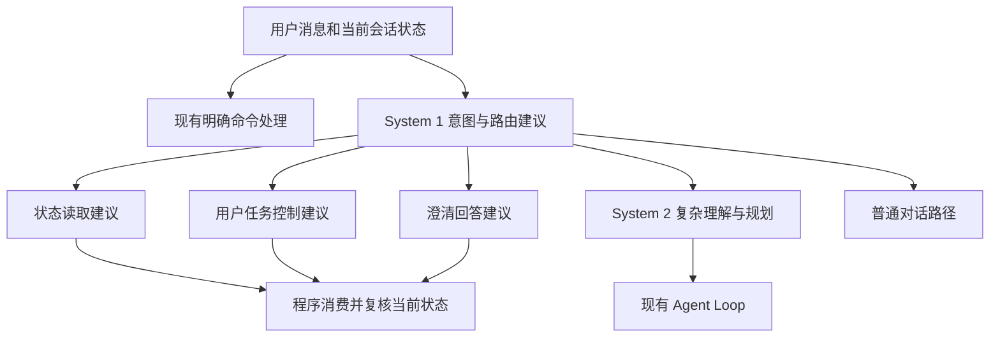

# Decisions API：PAOS 会话入口意图识别与路由诊断

日期：2026-10-09。初次诊断源码参考：`9880080`，分支 `feature/planning-loop`。
v13.0.4 在 `c14f2a5` 基础上修订实验边界；v13.0.2 已提交，本轮不修改或评价其运行代码。

## 1. 结论与优先级

System 1 的优先方向调整为会话入口的意图识别与处理路径选择。
Decisions 判断用户当前想做什么，以及应进入哪条现有路径；GPT 负责复杂理解、计划生成
与异常分析；程序继续管理任务状态、精确参数与执行。Lesson 排序保留为辅助方向。

本结论补充并更新[此前 System 1 / System 2 诊断](SYSTEM1_SYSTEM2_DECISIONS_DIAGNOSIS_20261009.md)
的候选优先级。[独立能力验证方案](DECISIONS_INTENT_ROUTING_CAPABILITY_VALIDATION_PLAN_20261009.md)
只评估预测结果，当前会话处理链保持原状。

## 2. 意图与路由的区别

意图识别回答“用户现在想做什么”：查询进度、控制任务、回答澄清、新建任务、分析问题或
普通对话。路由选择回答“结合当前状态，应交给哪个处理入口”。同一个意图在不同状态下
可以进入不同路径。

例如“继续”在当前任务已暂停时可指向 resume，在等待用户回答时可能没有补齐澄清条件，
没有当前任务时也不足以确定继续对象。只分类一句裸文本，无法验证这种状态依赖能力。

System 1 的输入应包含最新用户消息、相关短对话、当前任务摘要、待回答问题和固定结构的
能力状态。能力状态只表达 `has_current_task`、`task_status`、`pending_clarification`、
`read_status` 与 pause/resume/stop 可用性，避免逐样本写出预期 route 的能力描述。固定的全量
候选说明不构成标签泄漏；状态由程序提供，模型解释文本与状态之间的关系。

## 3. Laya / Jev 应用提供了哪些依据

| 来源 | 已查看的机制 | PAOS 可借鉴的部分 |
| --- | --- | --- |
| Laya 原项目 model-router preset | difficulty、domain、needs_tools、is_sensitive；代码组合成模型层级 | 判断工作类型，再由程序选择后续处理路径 |
| `glukicov/laya_router` | 两种 backend 回答相同 tier/needs_tools/is_sensitive 问题，服务返回路由结果 | 将路由判断作为独立能力，分开测分类与后续处理 |
| Laya CrewAI integration | 任务描述与已有 Agent role/goal 匹配，选择负责者 | 现成 Skill/能力候选匹配，允许升级到通用认知路径 |
| Jev 官方 Intent Routing | intent 与 complexity 并行判断，代码路由到确定性处理、专业 LLM 或人工 | 最直接的入口路由参考 |
| Jev 官方 Skill Suggestion | 广泛排名后详细读取少量 Skill，可拒绝全部；建议由 Agent 消费 | Skill 建议与正式 activation 分开 |
| Jev Code Reviewer | Jev 分类优先级，OpenAI 生成解释，程序应用展示 policy | System 1 判断 / System 2 解释 / 程序控制的职责组合 |

`laya_router` 服务的 `/route` 返回分类对象；查看的服务源码没有证明它直接执行所有下游
模型任务。其作者报告在 180 条手写样本上，Laya 与 GPT-5 nano 的 tier accuracy 均为
0.600，错误分布不同；数字是外部报告，未在 PAOS 重跑。作者也记录了类别措辞敏感性。

Jev Code Reviewer 的 demo 使用真实预录 Jev 分类与准备好的解释文案；它不是 GPT/Jev
完整在线效果的实测证据。借鉴其架构分工，不把演示呈现当作质量证明。

Laya 的 `Router` 还承担语言/checkpoint 选择；这是模型内部使用路径。
PAOS 要验证的是业务入口路由，两种 router 的职责应分开。

## 4. 当前 PAOS 的结合点

基于已提交源码与本轮只读检查，当前普通自然语言消息最终进入生成式 Agent Loop。
已有会话、任务摘要、命令、澄清与工具可见性机制，可作为后续结合点。

| 当前位置 | 当前职责 | 路由能力的可能作用 |
| --- | --- | --- |
| `AgentLoop.run()` | 消费消息；显式 `/stop`、`/restart` 进入专用处理 | 明确命令继续直接处理；自然语言作为独立候选 |
| `AgentLoop._process_message()` | 会话、等待澄清、任务摘要、普通消息处理 | 构造状态相关的入口判断输入 |
| `_task_for_session()` 与 Coordinator | 确定当前会话关联的真实 task | 提供 task ID/status，不让模型猜身份 |
| `LongHorizonTaskController` | status、pause、resume、cancel 等任务控制 | 消费控制意图；实际控制仍走现有 owner |
| `ToolRegistry.get_definitions(names)` 与 `_run_agent_loop()` | 工具可见性、当前回合范围与调用校验 | 未来按处理路径缩小候选，保留现有范围约束 |
| Skill activation / planner | 选择方法，创建任务与物化计划 | System 1 建议入口，System 2 形成完整任务与计划 |

源码路径：`PhyAgentOS/agent/loop.py`、`agent/long_horizon.py`、
`agent/tools/registry.py`、`agent/tools/forge_task.py`；`agent/` 省略前缀为 `PhyAgentOS/`。
已有源码正在被其他任务修改，本文用函数名定位，不将先前行号当作固定接口。

一个具体诊断点是等待澄清：当前入口发现 `waiting_for_user` 后，将下一条输入提交为
clarification answer。用户也可能是在询问进度、停止任务或提出新问题。
独立样本应考察“是否真的回答了当前问题”，本轮不修正现有行为。

## 5. 建议的职责关系

图是后续架构方向。当前能力验证只保留输入、System 1 调用与结果记录，不连任何下游路径。

若后续进入集成讨论，System 1 输出仍只是一次入站消息的路由提议：显式命令先走现有确定性
处理；每个入站回合最多做一次入口判断；System 2 接收原始消息、相关上下文与状态，而不是只
接收一个 route 标签；Decision → System 2 后不再次回到 Decision，避免形成无状态递归路由。
任何 confidence、概率或简单路径标签都不能创建任务、回答澄清、控制任务、选择 Runtime、
调用 Tool 或结束 AgentLoop。

建议优先识别处理路径，再考虑 Skill 路由与节点 Tool 路由。
开始就把全部 Tool、所有参数和完整 Skill 文档塞进一次分类，会混淆入口识别与执行选参。

## 6. 项目边界与替换收益

明确命令、精确 task 身份、状态读取、版本匹配和字段投影继续由程序处理。
两种模型均不持有 task 状态、Gateway 执行面、Evidence 或 Verifier 权力。

用户请求停止属于现有用户控制路径；`ForgeTaskCancelTool` 是 Agent 基于持久化阻塞证据
提出取消的工具，两者不可直接混用。高 confidence 不表示实际动作已经停止。

路由只能缩小当前允许的能力范围。未来若接入，effective tools 应同时满足原回合范围
与所选处理路径；入口选择不扩大 node/continuation 权限。

复杂或信息不足的请求升级到 GPT；外部事实仍需现有 Query 或用户澄清提供。
引用、否定和多意图输入要保持原消息，不能只把一个标签传给后续模型丢掉其余要求。

收益分为三种：状态/现成控制可能减少生成式回合；新任务路由主要减少无关探索；Skill
建议主要减少目录阅读。独立分类成功只支持“具备路由判断能力”，不直接证明在线节省。

## 7. 对独立验证的要求

- 输入优先使用 synthetic 场景；任务 ID 使用不会命中真实记录的 synthetic namespace。选用
  真实消息前先做人工选择与脱敏，不保存凭据、私有任务正文或鉴权 header。
- standalone runner 不导入 AgentLoop、Coordinator、Gateway、Runtime 或 PAOS 写连接，只
  调用配置中的 Decisions endpoint；输出意图、路由、概率和 confidence，不执行 handler。
- 重点覆盖状态依赖、等待澄清、否定/引用、多意图、复杂分析和无活动任务。
- evaluation 标签在 API 调用前完成独立复核与争议裁决；类别定义和人工标签作为评估对象，
  程序的一致性检查只报告矛盾，不改写模型原始答案。
- 一个逻辑样本使用稳定 run/case/request ID；transport attempt 单独编号，timeout 重试不产生
  第二个基础预测，也不因预测错误而重试。
- 当前方案、配置、provider、Skill、Runtime 与部署保持原状。

## 8. 资料

1. [OpenAI Decisions](https://developers.openai.com/api/docs/guides/decisions)。
2. [OpenAI Decisions 路由到推理模型](https://developers.openai.com/api/docs/guides/decisions-voice#route-complex-requests-to-a-reasoning-model)。
3. [Laya 原项目](https://github.com/NandhaKishorM/laya)、[model-router 示例](https://github.com/NandhaKishorM/laya/blob/main/examples/29_presets_model_router.py)。
4. [Laya 路由应用](https://github.com/glukicov/laya_router)、[分类问题源码](https://github.com/glukicov/laya_router/blob/main/src/laya_router/questions.py)、[服务源码](https://github.com/glukicov/laya_router/blob/main/src/laya_router/service.py)。
5. [Laya CrewAI integration](https://github.com/NandhaKishorM/laya/blob/main/docs/crewai.md)。
6. [Jev Intent Routing](https://docs.typesafe.ai/patterns/intent-routing)、[构建原则](https://docs.typesafe.ai/concepts/how-to-build-with-system-one)、[Skill Suggestion](https://docs.typesafe.ai/cookbooks/skill_suggestion)。
7. [Jev Code Reviewer 架构](https://github.com/egma-ai/jev-code-reviewer/blob/main/docs/ARCHITECTURE.md)。
8. PAOS [开发者手册](../zh/03-developer-manual.md)、[Planning 设计](PLANNING_MODULE_DESIGN.md)、[输入选择设计](AGENT_TOOL_INPUT_SELECTION_DESIGN.md)。

外部应用为 2026-10-09 的只读资料分析；本轮没有安装、运行或调用 Laya/Jev。
