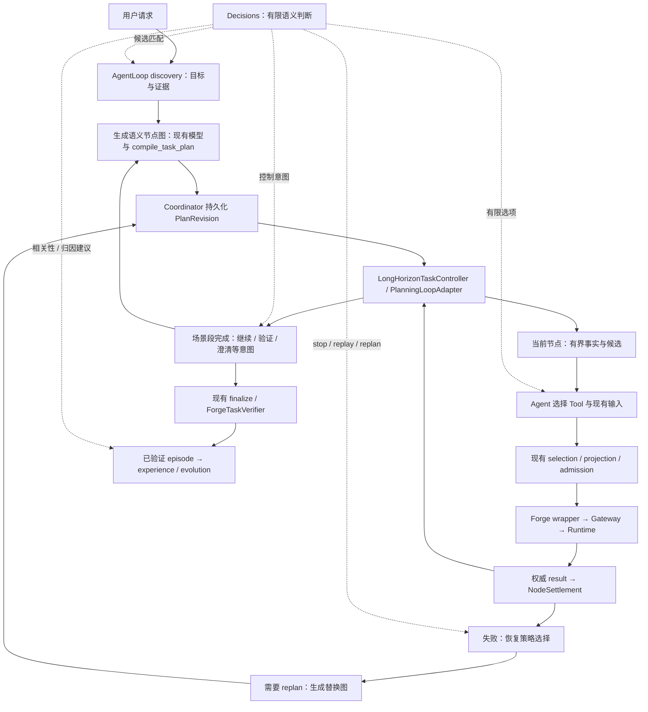

# GPT-6 Luna Decisions API：PAOS 架构适配与替换分析

日期：2026-10-09。源码参考：`e76506c`，分支 `feature/planning-loop`。
范围：保存诊断并分析接入方向；本轮只新增文档与日志，运行代码、部署和现场任务保持原状。
API 使用诊断见[配套文档](../diagnostics/gpt-6-luna-decisions-api-usage-20261009.md)。

## 1. 核心结论

Decisions 最适合替换 PAOS 认知侧输出为有限选项的模型调用。首个具体替换点是
`AgentRecoveryDecisions.select_recovery()` 中的 `stop/replay/replan` 模型选择；首个低风险
验证点是 `SkillActivationManager.relevant_lessons()` 的语义排序。Skill 匹配、节点内有限
Tool/实体选择和场景段控制意图选择也可使用，但各自保留当前的激活、选参、生成和执行边界。

PAOS 持久化状态驱动的 Agent loop 与 Decisions 的无状态判断可以自然组合。每次调用使用
当前 task/revision/node 的有界事实投影；结果作为 Agent 提案，由现有工具和 Coordinator
接纳。概率不进入 Runtime readiness、几何事实、NodeSettlement 或用户级成功的事实字段。

当前没有专用 Decisions transport，也没有相关调用实测。以下候选均为设计建议，优先级表示
适配程度与验证顺序，不表示已经完成替换或已经证明质量提升。

## 2. 依据与设计原则

| 已读依据 | 提取的原则 | Decisions 的对应约束 |
| --- | --- | --- |
| `docs/zh/01-framework-introduction.md` §1–6 | 认知规划、执行事实、Evidence、Verdict 分属不同 owner | 只能提出判断；不伪造 execution/evidence/verdict |
| `docs/zh/03-developer-manual.md` §1、5–7、12 | provider-neutral、node-scoped、持久化 task 连续性、唯一执行面 | API/模型实现放 provider/插件边界，复用上下文与 wrappers |
| `docs/user_development_guide/README.md` §1、7–9 | 模型接入用现有 provider/config；能力通过通用接口；Anti-OverDefense | 不新建机器人通路、固定任务 runner、通用 hash/gate 或第二事实库 |
| `docs/forge/PLANNING_MODULE_DESIGN.md` Ownership、Planner/plugin、Long-horizon | 纯 planning 协议；插件拥有方法；Coordinator/Gateway 拥有状态/执行 | 新 transport 不放 `PhyAgentOS/planning`；复用 recovery callback |
| `docs/forge/AGENT_TOOL_INPUT_SELECTION_DESIGN.md` Ownership、Extension Rule | Agent 语义选择；Coordinator 精确解析；consumer 定义 schema | 选择现存 ID/候选，现有 projection 组装 payload |
| `docs/adr/0001-runtime-ownership-and-skill-use.md` 与 migration design | 方法选择与 Runtime owner 分离 | 选 Skill 只改变方法使用，不更换执行 owner |
| `docs/zh/05-agent-experience-and-skill-evolution.md` §3–8、10 | 去敏、scope、独立支持计数、确定性归因、受控晋升 | 分类/排名可模型化，支持计数与晋升逻辑保持原 authority |
| `docs/zh/06-consequence-driven-skill-evolution-design.md` §1–5 与 `docs/forge/EVOPHY_CLOSED_LOOP_REVIEW.md` | TRACE 保留 joint cause set 与 unknown；已有 extension lifecycle | Decisions 排序另需实现和实验，保留现有审核晋升 |

框架介绍和部分 migration 文档的标题状态来自较早阶段。当前是否可调用以本轮源码为准；
引用这些文档的 ownership 规则，不把旧“未实现”或研究计划当作当前部署事实。
根目录用户提供的 AGENTS 规则同样适用。本轮没有新增防御机制，也没有修改历史诊断。

## 3. 当前 Agent loop 与合理位置



源码接入点：

| 位置 | 当前行为与证据 |
| --- | --- |
| `agent/loop.py:481` `build_long_horizon_controller` | planner recovery callbacks 注入既有 PlanningLoopAdapter |
| `agent/loop.py:1783` `run_node_turn` | 从空 history 构造有界 node projection；只暴露节点工具；提交后 yield |
| `agent/planning_loop.py:664` `AgentLoopNodeExecutor` | 先恢复 selection/record，核对 invocation，再返回节点执行结果 |
| `agent/planning_loop.py:1237` `PlanningLoopAdapter` | ready progression、节点结算、scene refresh、recovery |
| `agent/loop.py:1877` `run_segment_continuation_turn` | 已结算场景段的受限控制回合；按 result 路由决定 Query 可见性 |
| `agent/recovery_decisions.py:107` `select_recovery` | 非可恢复事实确定性 stop；否则模型选三类策略；保存既有 event |
| `agent/recovery_decisions.py:148` `propose_replan` | 模型生成完整 nodes；compile、reconcile delta、一次纠正 |
| `agent/experience/activation.py:251` `relevant_lessons` | active/version 过滤后 term-overlap 排名，有数量上限 |

`segment_completed` 是图段结算；完整用户目标是否满足仍经 finalize/Verifier。
当前 continuation 源码在 `refresh_scene_before_next_segment` 路径开放 `forge_tool_query`；其他
路径不靠隐式 Query 刷新。接入时保留这种基于真实结算结果的区别。

## 4. 可新增或替换的功能矩阵

| 功能 | Decisions 形态 | 替换范围 | 推荐顺序 | 保留的职责 |
| --- | --- | --- | --- | --- |
| 恢复策略选择 | choice：stop/replay/replan | 替换已有三选一模型调用 | 首个在线替换候选 | 确定性不可恢复 stop、unknown 对账、预算、scene refresh、replan proposer |
| Lesson 相关性排序 | predicate/score：每条 Lesson 是否适用 | 替换词重叠排名或用于候选重排 | 首个离线验证候选 | active/Skill/version scope、数量上限、排除条件、激活快照 |
| Skill 匹配 | choice：真实可用 Skill 或 none/reason | 增加匹配服务，替换部分通用模型选择步骤 | 第二阶段 | SkillsLoader availability、显式 activation、SkillUse 归因 |
| 当前节点 Tool 选择 | choice：ready candidate Tool | 替换“选哪个实现” | 第三阶段 | ready set、consumer schema、argument sources、selection receipt、Gateway |
| 已存在实体/目标候选选择 | choice：可见候选 opaque ID 或 unclear | 替换简单语义指代选择 | 第三阶段 | identity grounding、scene/calibration、几何、consumer projection |
| 场景段控制意图 | choice：continue/finalize/clarify 等当前合法意图 | 替换控制类别判断 | 第四阶段 | 新 nodes、澄清文本、必要刷新 Query、工具副作用、最终验证 |
| 自然语言入口分类 | choice：查询/任务/分析/澄清 | 新增有限请求路由 | 有明确节省后接入 | 精确命令快速路径、任务契约生成、生命周期 tools |
| 失败经验 eligibility | choice：既有 eligibility reason；predicate：工作流相关 | 部分替换 analyzer 分类 | 独立后台试验 | attribution guard、assessment 全结构、归因 scope、真实语义 verdict |
| Lesson cluster 匹配 | choice：同 scope 的 cluster 或 new/uncertain | 替换有限 cluster 语义匹配 | 独立后台试验 | workflow/owner scope、唯一支持与 cluster 计数 |
| EvoPhy 假设排序 | 多个 predicate/score | 既有 extension 的候选排序扩展 | 研究阶段 | PULSE 证据、时间链、unknown、joint causes、patch 评估与晋升 |
| 视觉可见条件辅助判断 | predicate/choice | perception/verifier 的部分子判断 | 单独证据质量验证 | 图像采集归属、schema、事实来源、metric geometry、Verifier authority |

分类任务可以没有自由文本解释；涉及恢复和审核的现有字段要求 reason/rationale。
Decisions 不返回解释，因此不能把 choice 直接伪装成当前完整函数输出；接入方案见下节。

## 5. 重点候选的具体设计

### 5.1 恢复策略：直接替换点最明确

当前 `_ask(..., replan=False)` 通过 function calling 返回 `{decision, reason}`。
Decisions 可返回 `decision`，来源是相同的持久化失败上下文、原始目标、约束与 delta。

推荐流程：

1. 保留 `select_recovery()` 中 Tool 明确 `retryable_in_revision=false` 且
   `requires_replan=false` 的确定性 stop；这些事实不需要额外模型判断。
2. 其余恢复选择通过可选 decision service 提出 stop/replay/replan。
3. 事件 reason 明确写“Decisions selected replan”，加当前 revision/node 与诊断引用；
   这是选择记录，不伪造“已找到原因”的解释。若产品确实需要因果解释，再调用生成模型。
4. 低置信或语义复杂时在当前决策总 deadline 内回到现有 `_ask`；不为每个步骤重置完整超时。
5. 确认 replan 后仍用原 `propose_replan()` 生成图；Coordinator 检查与保存新 revision。

当前 `_recover()` 对 outcome_unknown 返回 `reconciliation_required`；即使选择 replay，
也只重算已持久化事实。`stop` 表示停止自动推进，不能证明物理 stop 已完成。
Decisions refusal、transport failure、低置信和事实上的不可恢复必须在日志中区分。
如果原模型备用路径也不可用，沿用现有 recovery unavailable/stop 行为；注意 failed
settlement 的 stop 可能通过 Coordinator 把 task 标记 failed，不应静默将低置信映射为这种终态。

有限决策可重试是否发生由既有 provider/调用预算决定；Gateway Action POST 绝不跟随模型请求重试。

### 5.2 Lesson 排名：先验证语义收益

`relevant_lessons()` 当前使用英文词和中文双字重叠。语义同义、跨语言、否定条件容易成为
候选遗漏场景；是否实际影响本项目，需要标注样本确认，不能仅凭此分析宣布缺陷。

先按现有 active、Skill、精确 version 条件过滤；对有界候选提供 task summary、
`applies_when`、`does_not_apply_when`，用独立问题评估 applicability，再由程序排序和裁剪。
不要只拿现有 top-k 再重排并声称解决漏召回；可先重排较宽的已有 scope 候选。

现有函数是同步的，不能在里面用同步网络请求阻塞 Agent event loop，或用 `asyncio.run`
包异步 transport。在线版本需在激活前异步准备排名，再交给现有 activation 完成快照；
先做离线比较可以避免立即改变调用链。

服务不可用时保留当前词重叠路径。排名不改变 Lesson 内容、状态、支持计数和 task 已冻结建议；
同一个已创建任务的验证继续使用其原快照。

### 5.3 Skill 与 Tool：选择候选，复用执行

Skill 候选来自 `SkillsLoader.list_skills()` 的实际可用目录。Decisions 返回精确注册名或
none/reason；通过既有 `activate_skill` 使用，保留 primary/supporting 与 version 归因。
多 supporting Skill 可以逐步选择或用多个独立 predicates 推荐，再由 Agent 激活；
单个 choice 不代表多选集合。已持有执行 binding 的任务不会因选择新 Skill 而迁移 Runtime。

节点 Tool 候选来自当前 `forge_plan_ready` / `AgentComposedDispatch.describe()`。
只有多个语义可行实现时，模型选实现才有意义。已有唯一 Tool 和完全确定的参数映射时，
首先复用 Coordinator projection，不增加一次“模型确认”调用。

Tool 选择与参数生成拆开：

```text
ready candidates + bounded node facts
  → Decisions 选择精确候选 ID
  → 若有完整已声明 projection：现有选择/参数解析
  → 否则：当前节点生成模型补足任意参数或精确来源路径
  → ForgePlanSelectTool / persisted selection
  → 现有 wrapper + Gateway admission
```

不把 choice 伪造成 `ToolCallRequest` 去触发 generic registry；由现有 Agent/插件消费有限提案。
如未来需要直接调用现有 selection 工具，必须明确用本地 handler 构造参数，并经过完全相同
的 dispatch、receipt、提交和重启恢复流程。这属于后续集成代码，当前未实现。

### 5.4 实体选择与最近 held-entity 问题

语义选择可在当前授权证据的 entity summaries 中选精确 ID；如果目标不可见或有多个匹配，
保留 unclear。它不能证明感知身份与执行身份一致，也不能创造新的 entity/destination refs。

2026-10-09 held-entity 诊断的核心是 Runtime possession、Coordinator 连续身份投影和
视觉 ID 冲突：执行事实已证明持有，但后续理解没有正确保留该身份。Decisions 只能在已有
候选中选择；候选事实缺失时更换模型接口不能修复这一链路。继续使用已修复的 held evidence
与 grounding，不以模型概率替代 Runtime possession。
出处：`docs/forge/HELD_ENTITY_PROJECTION_DIAGNOSIS_20261009.md` Root cause / Repair。

### 5.5 场景段控制：类别可以替换，内容继续生成

`run_segment_continuation_turn()` 当前选择 CONTINUE、REPLAN、FINALIZE、STOP 或
WAIT_FOR_USER，并可能执行该 result route 允许的 context/refresh Query。
可从当前工具可用性和任务状态构造有限意图候选；状态非法的 transition 仍由 Coordinator 拒绝。

CONTINUE 要生成下一段 nodes；REPLAN 要生成 reason/替换图；WAIT_FOR_USER 要生成问题。
这些结果不能由一个 choice 完整表达。FINALIZE 是请求 Verifier，不是宣布成功。
正常 continuation 不消耗 failure-replan budget；新接口不能把二者混合。

不为了省一次生成调用，把用户目标编成固定 observe/propose/prepare/acquire/place 队列。
控制类别路由和完整 segment 回合都算在原总 deadline 内；只有实测节省大于新增往返成本时使用。

### 5.6 Experience/evolution：适合分类子任务

`ModelExperienceAnalyzer.assess()` 输出 rationale、candidate、failure observations、
适用边界和冲突等完整对象；`synthesize_lesson()` 生成文本；
`validate_lesson_abstraction()` 还要求 unsupported_literals 列表与 rationale。
Decisions 可以做 eligibility、候选 cluster 匹配或已有 Lesson 相关性子判断，无法直接满足
这些完整输出契约。不能为了匹配 API 形态删掉已有抽象审核或 unsupported_literals。

`assess_evolution_attribution()` 与 scope/count/晋升检查保留确定性。unknown/cancelled/stopped
及 projection errors 不因高概率改成可学习；反思失败继续 fail-open。重复任务独立支持计数
继续依靠现有 SQLite 唯一约束，不增加模型判定的“新 episode”。本轮不启用 evolution。

EvoPhy 已有 PULSE/TRACE 与候选生命周期实现，见 `extensions/evolution/evolution/` 和
`docs/forge/EVOPHY_CLOSED_LOOP_REVIEW.md`。Decisions 可对有证据的假设独立评分，保留
joint cause set/unknown；概率不代替因果证据、patch 实验和已有审核晋升。

## 6. 保留现有实现的功能

| 功能 | 保留理由 |
| --- | --- |
| `compile_task_plan`、PlanGraph/PlanNode 生成 | 任意节点、绑定、依赖与约束超出有限 typed answer |
| Plan readiness、拓扑/reducer、conditions 精确键查找 | 属于已知事实计算，概率会弱化语义且增加延迟 |
| Coordinator lifecycle/事务/单活动任务/预算 | 唯一持久化 authority；数据库约束已解决状态一致性 |
| 工具 schema 校验、argument_sources 精确解析 | 精确引用和类型可以程序验证，模型选择不能替代 |
| Scene revision、calibration、ownership、grounding | 属于事实链与执行边界；置信度不能授权缺失事实 |
| IK、碰撞、完整路线、控制器 limits、stop/reconcile | Runtime/provider 的安全与执行职责 |
| Evidence 采集、完整性、时窗、retention | 模型只消费已验证输入；已有措施继续保留 |
| Gateway invocation、Action/Session status/result、取消 | 既有调用身份与真实执行结果必须保留 |
| `ForgeTaskVerifier` 完整 verdict | 需要逐 criterion 状态、证据引用、reason、lesson、recovery context |
| Skill/Node 打包安装、Registry、Runtime availability | 精确制品和部署事实，无语义分类替换价值 |
| Skill 晋升、rollback、独立支持计数 | 既有正式修改边界；不能改成“score 足够就晋升” |
| 精确 `/task`/停止/取消命令 | 用户控制直接走当前 handler，避免在即时控制路径前增加云模型判断 |

Verifier 可以在其既有服务边界内使用 Decisions 做可观察 criterion 的辅助子判断，前提是
保留合法 evidence、不可见/unknown 语义、完整 verdict 和既有预算。该方向需要单独验证，
不作为第一批替换。不能用 `P(success)>0.9` 直接 finalize succeeded。

## 7. Provider 与插件接入路线

### 7.1 推荐：已有插件 seam + 可选 decision service

现有 `LLMProvider.chat()` 返回 `LLMResponse`，面向 text/tool calls；Decisions 返回 typed
answers。推荐在 provider 实现边界增加可选的异步 decision capability，由现有 recovery/
planner/experience 组件消费。OpenAI-specific 的 model、URL 和 SDK 留在 provider adapter。
其输出只需普通有限结果类型；复用已有 task/revision/node/event 关联，不新建通用冻结契约。

独立云 API transport 使用当前项目已依赖的 `httpx` 可实现，或插件环境安装新版 OpenAI SDK。
`pyproject.toml` 当前可选 OpenAI requirement 是 `openai>=2.8.0`，不保证满足 Decisions
示例的 `>=3.26.0`。不能仅改默认 model 就期望现有 LiteLLM chat 请求变成 Decisions。
自定义 API base/proxy 也必须确认支持 `/v1/decisions`；本轮没有验证代理或账户。

`RecoveryPlannerPlugin.select_recovery()` 已是可复用 seam。registry 要求完整 PlannerPlugin
的 compose/propose 方法，只有三选一方法的对象不能直接注册为完整 planner；可给现有 planner
注入 decision service，或用实现完整协议的包装插件委托原 compose/propose。
普通插件私有依赖放其环境；生产托管采用文档规定的插件/Skill-owned 环境和 provider-neutral
投影交换。不要为了一个 HTTP 调用新增 Dora scheduler、Node、数据库或 Runtime。

### 7.2 备选：显式有限 handler 适配

对于既有 UI/控制器已经持有完整参数的有限请求，可以用 choice 选择对应本地 handler。
参数来源必须是应用当前事实，handler 调用现有 Tool/Coordinator 公共接口。适合状态查询等
有限业务；不适合把任意 JSON/工具调用强行塞入 choices 或每个 PlanNode 写一个固定执行器。

无实际延迟/质量收益时，继续使用当前生成模型和确定性代码。新 API 使用范围显式按调用点
选择；不全局替换 `chat_with_retry()`，也不要求其他 provider 实现 OpenAI 专用功能。

## 8. Agent loop 实施原则与失败语义

1. 连续性来自 Coordinator 聚合；每次请求重新构造当前有界投影，不创建 provider session 真相。
2. discovery、node、continuation、recovery 的工具范围保持不同；不让 classification 取得泛化 shell/SDK 权限。
3. 一个 PlanNode 仍是一份 durable selection、一次 Tool execution、一个 settlement。
4. 执行前消费既有 selection/admission；取消、pause 或 revision 变化后的答案不能跳过当前校验。
5. 正常图段 continuation 与失败 replan 保持不同预算、证据与生命周期语义。
6. Provider timeout/transient/error、refusal、uncertain 与 Tool failure 保持不同。模型失败不制造 settlement。
7. 已接纳 invocation 优先对账；后续模型失败不能覆盖已落盘 execution result。
8. replay 仅重算持久化事实；unknown Action 不能再次 POST。
9. 语义建议保留 provenance：复用 existing event/DecisionTrace/SkillUse，有限 metadata 可记录模型、选项概率和延迟。
10. 保留 Anti-OverDefense：不新建 hash、SHA、baseline、重复 gate 或冻结协议；验证用普通测试与现有执行边界。

接入阶段应记录的具体失败：API 在用户 pause 或 revision 切换后返回旧选择。
已有当前 revision 检查、selection receipt 和 Coordinator 事务能阻止旧选择生效，
因此复用这些机制并测试取消传播即可，不增加新全局“决策冻结”系统。

## 9. 分阶段实施与验证

### 阶段 A：离线确认能力和收益

用去敏的已有选择场景构造人工标注样本，覆盖同义/跨语言 Lesson、同 scope 排除条件、
不可恢复软件故障、stale evidence、unknown effects、歧义实体与复杂请求。
比较当前路径、Decisions、Decisions 加备用生成模型的错误选择率、fallback rate、p50/p95、
tokens 与总成本。拒绝、取消和 API 异常单列，不当作正确分类。

当前独立问题合并；同一 task 的相互依赖判断保持顺序；独立任务样本可以并发测试。
这是使用当前实现作比较，不新增冻结 baseline/gate。先用 fake transport 测功能；付费测量
在后续明确接入/实验范围内进行，并报告实际 usage。官方约 10 倍不是本项目实测值。

### 阶段 B：集成恢复 choice

接入可选 transport、完整 provider error/取消映射和既有 recovery callback。
保留确定性 stop 与原 proposer。测试 unknown 不 POST、replay 不执行、scene refresh 未完成
不 replan、低置信备用失败、暂停/重启时当前 task 事实与已有预算。
该阶段验证主循环不变和调用点替换；不部署 Runtime 或自动恢复现场任务。

### 阶段 C：方法匹配与有限节点选择

先做 Skill/Lesson 异步匹配；再仅在真实多候选 Tool 或现存实体时接入 choice。
通过既有 ready/select/wrapper 完成调用，比较合法 selection 完成率和额外模型往返数。
完整参数生成、identity/geometry 与 deterministic projection 保持当前 owner。

### 阶段 D：控制类别与后台分类

continuation 使用 choice 路由再生成必要内容；保持当前 conditional Query 规则。
经验模块在完整 assessment 中使用分类子结果，验证 fail-open、scope/count/抽象校验。
正式 Verifier 与 EvoPhy 因果假设排序分别列独立研究/实现任务，不在以上接入中顺带更换。

未来实施可复用的实际测试命令如下；本轮只核对文件存在，未运行实现回归或付费 benchmark：

```bash
.venv/bin/python -m pytest -q tests/test_planning_effect_recovery.py tests/test_planning_loop.py tests/test_long_horizon_controller.py tests/test_runtime_review_regressions.py
.venv/bin/python -m pytest -q tests/test_context_activation.py tests/test_evolution_composition.py tests/test_workflow_policy_candidates.py
.venv/bin/python -m pytest -q tests/test_planning_selection.py tests/test_planning_dispatch.py tests/test_forge_tool_api.py tests/test_planning_source_assembly.py
.venv/bin/python -m pytest -q tests/test_agent_foundation.py tests/test_prompt_context.py tests/test_verifier_semantic_conformance.py tests/test_verifier_evidence_boundary.py
```

具体新增 fake Decisions 测试应覆盖语义不同的结果与恢复，不编写与实现逐行镜像的测试。
后续实现以实际测试文件与变更范围修订以上命令。

## 10. 性能预期与故障分叉

设原调用耗时 T，Decisions 为 D，仍需生成内容时为 G，备用模型概率为 p、耗时为 F：
新增前置路由的期望耗时约 `D + G + pF`，不是仅 D。纯三选一替换更容易收益；本来只有
一个合法选项、或绝大多数任务仍需完整生成时，新增路由可能变慢。

| 观察到的问题 | 优先检查 |
| --- | --- |
| `/v1/decisions` 不可访问 | SDK 版本、API base/proxy 支持与账户；保留现有调用点路径 |
| 分类快但端到端更慢 | 新增往返、fallback 比例、重复上下文；移除无收益前置判断 |
| 输出高置信但选择错 | 候选描述、排除条件、缺证样本、标注质量；不降低 execution 检查 |
| 节点仍无合法候选 | 查 facts/projection/grounding/ready set，不能靠模型创造 candidate |
| replan 后仍失败 | 区分策略选择、替换图生成、场景刷新与 Runtime cause；保留原失败 owner |
| Task 被低置信误标 failed | 检查 uncertain/refusal 是否被静默转换为 stop；回到有界备用处理 |
| Lesson 召回没有改善 | 检查候选是否在原词重叠 top-k 之前就被丢弃、scope 是否正确 |
| 生成 explanation 与 choice 不一致 | 把 choice 和真实证据一同传给生成模型，解释不得改写执行事实 |

## English summary

The strongest direct replacement is the model-backed `stop/replay/replan` choice inside
`AgentRecoveryDecisions.select_recovery`; replacement graph generation remains unchanged.
Lesson applicability ranking is the first low-risk offline evaluation target. Skill matching,
ready Tool/entity selection, segment control intent, and experience eligibility are further bounded
uses. Integrate an optional asynchronous decision capability at the provider/plugin boundary,
reuse current projections, selection receipts, wrappers, events, and Coordinator transactions, and
preserve existing model fallback within the same deadline. Deterministic state, runtime admission,
identity/geometry, reconciliation, node settlement, full verification, and Skill promotion retain
their existing owners. Current code conditionally allows refresh Queries during segment
continuation; preserve that behavior. This analysis implements no runtime feature and reports no
paid API, motion, deployment, or end-to-end acceptance result.
