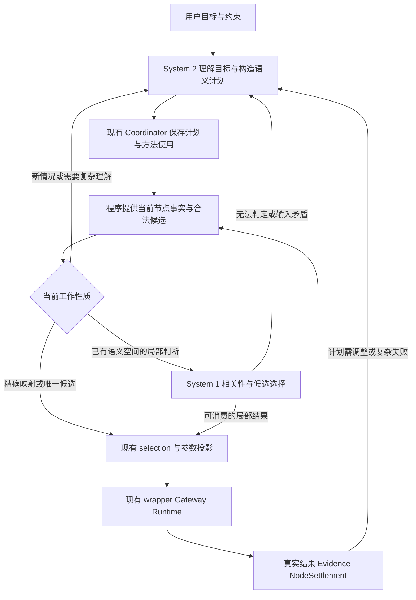

# PAOS：System 2 / System 1 分工诊断

日期：2026-10-09。源码参考：`d9d4c16`，分支 `feature/planning-loop`。
本轮交付：保存架构与功能诊断，供用户审核；能力验证方案在审核后另写。

## 1. 诊断结论

PAOS 可以将认知工作拆为两类：生成式大模型承担 System 2，负责复杂目标理解、方法选择、
语义计划构建和异常分析；Decisions API 承担 System 1，负责在现有事实和明确候选内做
局部语义匹配、相关性判断与常见类别选择。任务推进、精确参数投影和执行事实仍由现有程序负责。

这是一种架构职责分工。System 1 / System 2 在本文表示工作的性质与使用方式；官方文档
没有证明 Decisions 模型的内部机制等同于人类直觉，也没有证明其完全不进行推理。
接口支持有限答案，是接入条件；具体问题能否局部判断，才决定是否适合交给 System 1。

当前项目已有 node-scoped 上下文、持久化语义图、Tool 候选与确定性参数投影，具备拆分基础。
当前没有专用 Decisions 调用能力，也没有项目内质量或延迟实测；诊断中的适合程度是候选判断。

原[架构适配分析](GPT6_LUNA_DECISIONS_PAOS_FIT_ANALYSIS_20261009.md)按输出形态推荐
恢复三选一优先。本次按认知复杂度修正：优先考察 Lesson 局部语义相关性，以及现成候选的
常规匹配；恢复策略整体保留 System 2，只把有充分事实和清晰适用条件的常规实例列为后续候选。
旧文档保留为历史分析；本次分工与优先级以本文为准，旧文档验证章节不作为本轮交付方案。

## 2. 三类职责及划分依据

| 职责 | 适合的问题 | 结果 | PAOS 中的 owner |
| --- | --- | --- | --- |
| System 2：复杂理解 | 目标含糊、约束冲突、新情况、跨步骤依赖、因果分析 | 解释、澄清、语义节点图、替换计划、经验抽象 | 现有 Agent / planner / analyzer |
| System 1：局部判断 | 事实充分、语义空间已定义、已有候选、无需重新构建方法 | 相关性、条件判断、有限候选或类别 | Agent 认知侧的可选 decision capability |
| 确定性程序 | 精确身份、状态与版本、依赖计算、字段投影、事务、已有执行约束 | 精确候选集合、参数、持久化记录、结算 | Coordinator / dispatch / Gateway / Runtime |

第三类独立保留十分关键。只有一个合法 Tool、已有精确 entity ID、字段映射已声明时，
程序直接处理即可；添加模型确认不会增加必要能力。

局部判断的分界要看输入是否足够回答问题。例如“这条经验与任务是否语义相关”可以局部判断；
“它在这个陌生场景里是否安全有效”可能需要新的事实与复杂推理。两个问题都能输出 yes/no，
工作量与责任却不同。

有限候选的含义也须已经清楚。“三种已经描述好的取物方式，哪一种符合当前偏好”是局部匹配；
“要通过哪些动作才能达成目标”需要构造方法与依赖，属于 System 2。

## 3. 当前 Agent Loop 的认知混合点

| 当前入口 | 现有工作 | 按新分工的诊断 |
| --- | --- | --- |
| discovery / plan proposal | 理解目标、读 Skill、构造语义节点图 | System 2 主责；已有 Skill 的常规匹配可拆出 |
| `AgentLoop.run_node_turn()` | 读当前节点事实、选 Tool、选输入、调用 wrapper | 同时包含局部判断与开放生成，是主要拆分位置 |
| `AgentRecoveryDecisions.select_recovery()` | 读完整失败上下文，返回策略与 reason | 简短输出包含复杂分析，整体仍归 System 2 |
| `propose_replan()` | 生成完整替换图，并处理编译纠正 | System 2 |
| `run_segment_continuation_turn()` | 判断下一段意图，可能刷新 Query、生成节点或澄清 | 类别判断可局部拆分，后续内容与复杂判断保留 System 2 |
| `SkillActivationManager.relevant_lessons()` | 词重叠过滤、排名、截断 | 当前为确定性启发式；可增加 System 1 语义能力 |
| `ModelExperienceAnalyzer` | 评估经验、抽象 Lesson、检查未支持内容 | System 2；常规分类子判断可独立考察 |

`run_node_turn()` 从空对话 history 构造当前节点消息，携带原始目标、verification、
SkillUse 身份和有界 node context，并在节点执行工具提交后交还控制权。因此新分工适合
嵌入现有节点回合，由已有持久化状态推进；没有必要另建一套 System 1 执行循环。

`AgentLoopNodeExecutor` 已处理恢复 selection/record 与 invocation 对账。
认知服务变化应继续消费这些既有事实；节点重启后不应因为重新调用模型而重复提交执行。

源码依据：`PhyAgentOS/agent/loop.py:1783`、`agent/planning_loop.py:664`、
`agent/recovery_decisions.py:25` 与 `:107`、`agent/experience/activation.py:251`。
此处及后文以 `PhyAgentOS/` 为省略前缀。

## 4. 建议的认知协作关系



图描述拟议职责，当前代码尚未实现 System 1 路径。

System 2 定义目标、成功条件、方法与节点含义；程序从当前 ToolSpec、场景和执行记录中
构造实际候选；System 1 在这两者共同限定的空间里判断。复杂理解结果可在既有 task、
revision、Skill instructions 中复用，当前事实仍需来自当前投影。

复用的是方法与语义，更新的是证据与候选。例如 System 2 理解了“按颜色分别归位”的要求，
后续局部判断可在当前可见实体中匹配颜色；已被拿走的实体、变化后的场景仍需由现有投影更新。
最终执行 ID、位置与 consumer 参数由程序解析。

复杂理解应在新目标、真正的语义歧义、候选意义改变、冲突与需要重规划时介入。
无需每个节点都先让 System 2 写完整答案，再让 System 1 确认一遍；这种串联保留了原开销。

工作分流可以利用当前节点类型、候选数量、必要字段缺失和已有失败语义。
是否还需要模型参与分流，本轮没有证据支持；不先新增独立 router 模型。
单个 confidence 也不能可靠识别所有复杂情况：缺失事实、冲突与新问题应依据输入和既有
执行语义处理，而非只等概率变低。

升级到 System 2 后，缺失的外部事实仍需通过当前允许的 Query 或用户澄清取得。
更复杂的推理可以识别缺口与选择调查方法，但不能把缺失观测推理成已确认事实。

## 5. 功能替换范围

| 功能 | System 1 可承担的部分 | System 2 保留的部分 | 当前功能关系与适合程度 |
| --- | --- | --- | --- |
| Lesson 相关性 | 同 scope 内任务与经验条件的语义匹配 | 条件含糊、经验冲突、跨场景迁移与重新抽象 | 增强现有词重叠；最清楚的局部语义候选 |
| Skill 匹配 | 已知任务意图与已存在 Skill 描述匹配 | 组合新方法、拆解目标、处理约束冲突 | 部分替换通用模型选择；取决于候选区分度 |
| 节点 Tool 选择 | 多个真实合法实现之间的语义选择 | 新的执行策略、开放参数生成、必要 Query 选择 | 可部分替换节点判断；唯一候选直接程序处理 |
| entity / destination 选择 | 当前候选中简单属性或指代匹配 | 复杂空间关系、历史身份冲突、未解析指代 | 可部分替换语义选择；身份与几何仍归程序 |
| 场景段控制 | 证据清楚时请求继续、验证或澄清的类别 | 下一段节点生成、复杂目标判定、澄清文本 | 只替换控制子判断，未必减少总调用 |
| 恢复选择 | 已有充分诊断、常规策略适用条件清楚的实例 | 失败原因推断、是否能通过重规划解决 | 有条件候选；不再列为首个整体替换点 |
| 经验分类 / cluster 匹配 | 同 scope 内现有类别或 cluster 匹配 | rationale、经验抽象、unsupported_literals 与冲突分析 | 可拆分类子任务，保留完整 analyzer |
| EvoPhy 假设排序 | 有证据假设的局部相关性排序 | 因果诊断、新假设、patch 与评估解释 | 研究候选，未证明因果质量 |

“部分替换”是替换当前模型处理的一类实例或一个子判断，保留函数其余职责。
Lesson 排序则是把原来的无模型启发式提升为语义判断，具有新增延迟与费用；它能验证局部
理解能力，但单独成功不能证明已替换项目中的生成式模型调用。

## 6. Lesson 排序：按这个思路展开

### 6.1 当前排名到底做了什么

`relevant_lessons()` 先选同 Skill 的 active Lesson；提供版本时只接受当前精确版本或
`==version`。然后提取英文词与中文双字片段，计算 task summary 与 `applies_when`、
`does_not_apply_when` 的重叠。

当前过滤与排序规则为：

```text
applies_overlap = 任务词片段 ∩ 适用条件词片段 的数量
excludes_overlap = 任务词片段 ∩ 排除条件词片段 的数量
applies_overlap == 0 或 excludes_overlap >= applies_overlap → 排除
其余按 (applies_overlap - excludes_overlap, observation_count, updated_at) 排序
最终裁剪到 max_lessons_per_skill
```

因此它衡量词面接近程度，缺少关系与否定理解。相关性也可能在排序前就被过滤掉；
只对现有 top-k 重排无法挽回这部分候选。

### 6.2 System 1 能补足的局部能力

下表是概念示例，用于解释差别；不是项目已测案例。

| 任务与当前已知事实 | Lesson 条件 | 词重叠的局限 | System 1 所需判断 |
| --- | --- | --- | --- |
| “把杯子挪到后方收纳区” | “转移容器到指定区域时适用” | 同义表达可能没有足够重叠 | 是否描述同类局部工作 |
| “放置目标不是易碎品”，当前已确认材质 | “处理易碎目标时适用” | 共用“易碎”不等于条件成立 | 理解否定与条件不满足 |
| 中文任务，英文适用条件 | “Relocating a container to its destination” | 跨语言词面相似度很低 | 跨语言语义匹配 |
| “搬杯子”，材质信息未知 | “仅玻璃杯适用，塑料杯排除” | 任务摘要缺少决定性信息 | 将相关与已满足适用条件区分 |

最后一行特别关键：任务没有提到玻璃，既不证明目标是玻璃，也不证明排除条件不成立。
System 1 可以判断 Lesson 与任务相关，但若其使用依赖材质事实，当前输入就不足以确认
适用。相关性候选与可直接采用的经验应保持语义区别。

System 2 的作用是理解任务目标并提供必要的语义背景；已有 Runtime/Query 事实则提供
具体条件。经验写入、抽象与适用边界形成仍属于原经验机制。每次排名不必重新用大模型
解释所有 Lesson；只有新情况、冲突或条件需要复杂解释时才交回 System 2。

### 6.3 API 形态与当前边界

官方提供 predicate、choice、score。Lesson 排名可用 predicate 做局部相关判断，或用
统一有序标准的 score 评估相关程度；从一组经验中只选一条才适合 choice。
score 是等级索引的概率加权均值，含义取决于定义的等级；不等于已校准的适用概率。

同一输入中的多个独立 Lesson 判断可以放在一个请求。若后一判断依赖前一答案，官方
要求分别请求；不能假定一次请求内部有顺序推理。经验间冲突或组合效果也不属于独立排名。

System 1 的候选应来自既有 active、Skill、version 范围过滤后的集合，而非仅来自旧 top-k。
最终哪些事实足以支持“适用”须保持明确；排除条件文本同样进入判断，不因更换接口丢弃。
缺失条件本身是诊断结果，不能被高概率补成事实。

激活流程的 `_finish_activation()` 同步调用排名并写入 verification lessons。
因此后续在线集成需要在完成激活前异步准备语义结果，不能在同步函数中阻塞网络或调用
`asyncio.run`。这是现有调用链的适配点，本轮不修改它。

当前 task 使用其已有经验快照。语义重排改变的是新激活选择，不应每个节点覆盖既有 task
的经验引用、支持计数或归因记录。排名质量也不授予经验自动晋升的权力。

## 7. 恢复三选一：为什么优先级要调整

`select_recovery()` 的 `_ask()` 输入包括完整 graph、settlement、failed executions、
delta、context、目标与 Skill instructions。提示要求区分 stale evidence、软件或配置
故障，以及重规划是否能够解决原因；输出还包含 reason。这已经是复杂诊断工作。

例如“发生超时”不能单靠常见文本分类判断该重试还是重规划：执行可能已完成但结果尚未
确认，也可能是前置 Query 失败。输出空间相同，所需事实与处理责任不同。
当前 `_recover()` 对 `outcome_unknown` 保留 reconciliation，`replay` 只重算持久化事实，
不会重复 Action；这部分应由现有程序保持。

若某类常规失败已有清楚诊断与多个合理恢复方法，System 1 可以匹配已知方法的适用性。
若 Tool 已明确声明不可自动恢复，当前代码已经确定性 stop，再调用模型没有必要。
新故障、多因一果、与场景变化有关的策略仍交给 System 2；新 revision 的 nodes 由原
`propose_replan()` 生成。

Decisions 不提供自由文本 reason。已有 reason 不能通过一个 choice 全量替换：局部
选择记录可以注明来源；需要因果解释时仍由 System 2 提供。若每次都额外生成解释，
原模型调用未被省去。

此外现有 `_recover()` 在 failed settlement 下的 stop 可把 task 标记 failed。
无法判定、低 confidence 或 transport failure 与“事实证明应结束恢复”语义不同，
后续接入需交回原认知路径，不能为了适配三选一静默把它们变成 stop。

## 8. 架构、扩展与 Agent Loop 原则的对应关系

| 现有原则与依据 | 新分工的含义 |
| --- | --- |
| 认知与事实 owner 分离：框架介绍、planning ownership | 两种模型都只提出认知结果；Coordinator 持有 task/revision/record |
| node-scoped、证据驱动：developer manual、planning loop | 局部判断使用当前节点授权投影；真实结算后再推进 |
| Agent 语义选择 / consumer 参数 / Coordinator projection：Tool input design | System 1 输出语义候选；程序构造精确 payload |
| provider-neutral：developer manual、planner plugin | Decisions 是独立 typed capability，不能只把 chat 模型名改为 luna |
| 通用扩展：user development guide、Tool input Extension Rule | 不在 Core 写颜色、杯子或抓取专用分支；复用 ToolSpec 与候选接口 |
| Skill 方法与 Runtime owner 分离：ownership ADR | 认知模型分工改变方法使用，不更换 task 的执行 owner |
| evidence / verification 分离：experience 与 verifier design | 相关性、概率与分类不成为执行事实或用户目标完成证明 |
| Anti-OverDefense：用户 AGENTS、开发指南 §7.1 | 复用既有类型、事务与约束，本轮不新增 hash、gate 或第二状态库 |

`LLMProvider.chat()` 返回文本与 tool calls；Decisions 返回类型化 answers。
后续 transport 应位于 provider/认知服务边界，其使用策略归 Agent 或 planner；
纯 `PhyAgentOS/planning` 保持现有协议与纯计算职责。

`PlannerPlugin` 要求 compose_plan/propose_replan；仅实现三选一的组件不能注册成完整
planner。`RecoveryPlannerPlugin` 是附加能力，不代表可以替代整套规划。
拟议 System 1 能力应复用原 AgentLoop 回合、预算与调用消费位置，不再创建第二套 task、
Session、Evidence、Runtime 或执行入口。

完整回合仍是：理解与提案 → 原 selection/admission → 执行 → 真实 result/settlement
→ 下一节点或恢复 → finalize/Verifier。System 1 参与其中的判断；System 2 按复杂度介入。
调用 FINALIZE 表示请求验证，用户目标成功仍由既有 Verifier 负责。

最近 held-entity 问题属于 possession 与连续身份投影的事实链问题。无论哪种模型都依赖
候选输入的完整性；更换判断接口不能补出缺失的权威事实。沿用现有修复与 grounding。

## 9. 目前能下的结论与证据缺口

已能确认：API 输出形态适合局部语义问题；当前 PAOS 有有界认知上下文和确定性投影
作为拆分基础；Lesson 排名存在明确的词面算法边界；恢复三选一包含复杂分析。

尚需后续能力验证回答：实际任务里局部问题占多少，候选语义是否足够清楚，语义判断能否
提高 Lesson 选择质量，是否能替代某些现有生成式调用，以及包含升级处理后的净耗时。
这些问题当前没有项目实测结果。

官方描述 Decisions 相比 Responses 约快十倍，属于接口层说明。PAOS 的实际收益取决于
省去的原模型调用、候选准备、网络往返和升级到 System 2 的工作量。
Lesson 路径当前是本地函数，引入 API 会新增成本；Tool 路径只有在省去完整节点生成
工作时才构成模型调用替换。两类收益需分别判断。

本次供审核的建议是：认可三类职责划分；优先考察 Lesson 相关性与现成候选局部匹配；
恢复整体保留 System 2；保留原程序与执行 owner。用户审核后，再围绕认可的候选写
最小能力验证方案。本轮未编写验证用例、提示词包、阈值、脚本或运行步骤。

## 10. 依据

- [Decisions 官方文档](https://developers.openai.com/api/docs/guides/decisions)：三种题型、独立问题、confidence、生成与工具调用接口边界。
- [此前 API 诊断](../diagnostics/gpt-6-luna-decisions-api-usage-20261009.md)：具体使用方法与官方资料差异。
- [框架介绍](../zh/01-framework-introduction.md)、[开发者手册](../zh/03-developer-manual.md)、[用户开发指南](../user_development_guide/README.md)。
- [Planning 设计](PLANNING_MODULE_DESIGN.md)、[Tool 输入选择](AGENT_TOOL_INPUT_SELECTION_DESIGN.md)、[Runtime ownership ADR](../adr/0001-runtime-ownership-and-skill-use.md)。
- [经验与 Skill 进化](../zh/05-agent-experience-and-skill-evolution.md)、[EvoPhy 闭环审查](EVOPHY_CLOSED_LOOP_REVIEW.md)、[held-entity 诊断](HELD_ENTITY_PROJECTION_DIAGNOSIS_20261009.md)。

EvoPhy 已有 PULSE/TRACE 与候选生命周期实现；其存在与 Decisions 接入或质量提升是不同
事实。引用旧设计文档时采用职责原则，当前实现行为以本文注明的源码为准。
